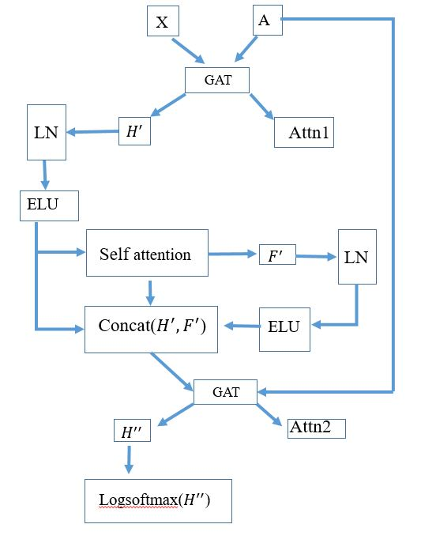

# GAT model

## Folder NN
contain main neural networks model. Architecture located in **GAT.py** In **Attention Layer.py** is additional attentional layer from paper: Attention all we need(https://arxiv.org/abs/1706.03762). 
The architecture of neural network is following:



file **train.py** contains training procedure for 1 epoch. The full trainig and prediction pipeline located in **FML.py** and based on abstract method *ModelTrainer*, the main class for tarining is *GcnTrainer*
Model will be saved in folder model_weights

## Folder preprocessing
This folder has main function for data preprocessing and initial graph building

## Folder additional_function
This folder has additional classes and functions, such as dataset and dataloader for graphs creation, metrics calculation

# Model Validation
model was validated on DCM dataset with LOO crocc validation policy. 1 patient was leave out as test dataset, then train dataset splitted to train and validation. Such as test patient has only 1 class, thus it is impossible to use all graph potential, this patient is embedded in the structure of the validation graph, thus predictions are made for test and validation at the same time, but metrics calcualted only on TEST data.

Cross validation module located in NN folder: **cross_validation.py**. Example of usage **crossvalidation example.ipynb**

# Usage

```python
model = GAT_transformer(args['input_dime'],args['num_classes'],args['s_max']).to(device)
trainer = GcnTrainer(model)
accuracy_train,accuracy_val = trainer.train(adata,args.args)
```
